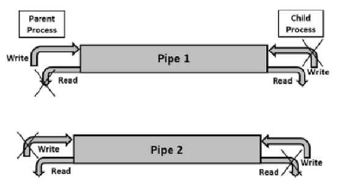
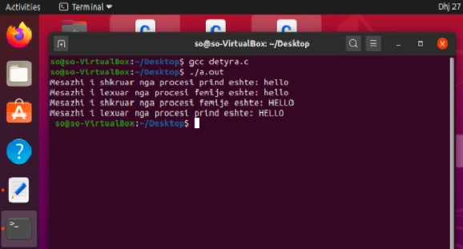
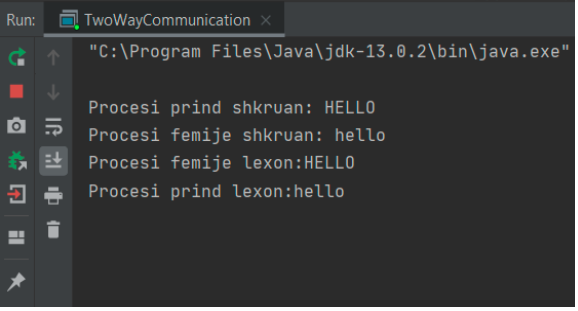
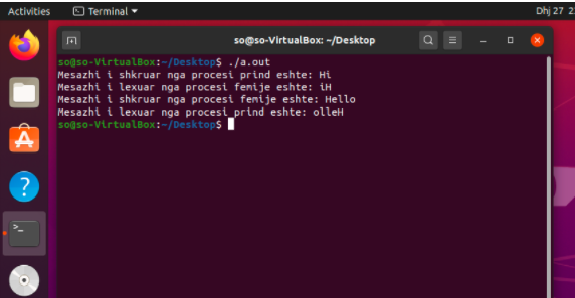

# Hyrje

Në këtë projekt është analizuar dhe diskutuar metoda ordinary pipes që përdoret për të mundësuar komunikimin mes proceseve. 
Ordinary pipe në sistemet operative lejon që të dy procedurat të komunikojnë në një mënyrë standarde dhe gjithashtu mundëson edhe komunikimin two-way.
Janë diskutuar edhe modalitete të tjera të komunikimit me ordinary pipes për rastet unidirectional si dhe bidirectional.
Implementimi i programit (funksionit) të tillë është realizuar në gjuhët programuese C dhe Java. 

# Ordinary pipes
Ordinary pipes janë objekte që lejojnë komunikimin standard të tipit prodhues-konsumues: prodhuesi shkruan në njërin cep të pipe-it (the wite end) dhe konsumuesi lexon nga cepi tjetër (the read end). 
 Në sistemet UNIX, konstruktimi i ordinary pipes bëhet me anë të funksionit pipe(int fd[]). Në këtë rast int fd[] përshkruan dy gjendje të ndryshme: fd[0] është the read end of pipe, ndërsa fd[1] është the write end. UNIX i trajton pipes si tip të veçantë të fajllit. Kështu, pipes mund të qasen përmes funksioneve ordinary read() dhe write(). Në anën tjetër, ordinary pipes në sistemet Windows, të ashtuquajtura anonymous pipes, sillen sikurse ekuivalentët e tyre në UNIX: janë njëdrejtimëshe dhe përfshijnë lidhjen prind-femijë në mes proceseve që komunikojnë. 
Në Windows, leximi dhe shkrimi në pipe mund të arrihet me anë të funksioneve ordinary ReadFile() dhe WriteFile(). Duhet cekur se ordinary pipes kerkojnë lidhjen prind-femijë gjatë proceseve të komunikimit në të dy sitemet operative, UNIX dhe Windows, që do të thotë se këto pipes përdoren vëtem për komunikimin mes proceseve në të njejtën pajisje (machine).[3]

# Komunikimi i dy anshëm me ordinary pipes
[4]Ordinary pipes janë uniderctional, lejojnë vetëm komunikimin në një anë ( njëanësor ) pra ose procesi prind shkruan dhe procesi fëmijë lexon ose anasjelltas por jo të dyja, nëse prindi dhe fëmija kanë nevojë të shkruajnë dhe lexojnë nga pipe njëkohësisht, zgjidhja është një komunikim i dyanshëm duke përdorur pipes. 
Kërkohen dy(2) pipes për të vendosur një komunikim të dyanshëm, ku secili pipe dërgon të dhëna në drejtime të ndryshme. 

# Algoritmi për të arritur komunikim të dy anshëm:

Hapi 1 - Krijimi i dy pipes: pipe1 është për prindin për të shkruar dhe fëmijën për të lexuar, ndërsa pipe2 shfrytëzohet që fëmija të shkruaj ndërsa prindi të lexoj.  

Step 2 - Krijimi i procesit femijë.

Step 3 - Mbyllja e skajeve të padëshiruara pasi që nevojitet vetëm një fund për çdo komunikim.

Step 4 - Mbyllni skajet e padëshiruara në procesin prind, lexoni fundin e pipe1 dhe shkruani fundin e pipe2.

Step 5 - Mbyllni skajet e padëshiruara në procesin fëmijë, shkruani në fundin e pipe1 dhe lexoni në fundin e pipe2.

Step 6 - Kryeni komunikimin mes dy proceseve.

# Ambienti i punës dhe veglat e përdorura

Virtual Box – Është përdorur si virtual machine për virtualizimin e sistemit operativ të përdorur për zhvillimin e projektit.

Sistemi operativ Ubuntu – Realizimi dhe testimi i programit është bërë në këtë sistem operativ.

Gjuha programuese C

Gjuha programuese Java

# Komunikimi i dyanshëm në gjuhën programuese C
Kodi i detyrës përfshinë fillimisht deklarimin e variablave, duke pëfshirë këtu mesazhet që do të shkruhen, variablën ku do të vendoset teksti i lexuar dhe vargjet per pipe1 dhe pipe2 (elementi 0 është për anën e leximit kurse elementi 1 për anën e shkrimit). Në vazhdim bëhet krijimi i pipes me metodën(system call) pipe(). Në rast të moskrijimit të pipe, returnStatus është -1 dhe programi i tregon përdoruesit se ka ndodhur një gabim, në të kundërtën vazhdohet me krijimin e një procesi fëmijë me metodën(system call) fork(). Krijimi i një procesi fëmijë do të mundësojë komunikimin me një proces tjetër, pasi pjesa e kodit poshtë pid=fork() do të ekzekutohet nga të dy proceset njëkohësisht.Nëse pid është 0 kemi të bëjmë me procesin fëmijë të krijuar kshtu që ekzekutohet pjesa e kodit në else, në rast të kundërt kemi të bëjmë me prindin. Edhe prindi, edhe fëmija shkruajnë në pipes përkatëse dhe lexojnë nga to. Procesi prind shkruan në pipe1 dhe lexon nga pipe2, kurse fëmija shkruan në pipe2 dhe lexon nga pipe1 duke arritur kështu komunikim të dyanshëm me ordinary pipes.

 Rezultati i komunikimit të dyanshëm në gjuhën programuese C

# Komunikimi i dyanshëm në gjuhën programuese Java
Detyra e njëjtë për arsye eksperimentimi është shkruar edhe në gjuhën programuese Java. Mirëpo me disa koncepte ndryshe duke marrë parasysh që Java nuk mundëson krijimin e një procesi fëmijë nga procesi në ekzekutim. Në këtë rast janë krijuar pipes dhe në mënyrë që të mund të shkruhet dhe të lexohet nga to janë përdorur threads për të imituar punën e proceseve paralele.
Fillimisht për dallim nga gjuha C pipes për shkrim me lexim krijohen nga PipedOutputStream dhe PipedInputStream respektivisht. Janë krijuar dy nga secila ashtu që të mund të zhvillohet komunikimi i dyanshëm. Instancat outputPipe1 dhe inputPipe1 korrespodojnë me pipe1 në programin në C, kurse outputPipe2 dhe inputPipe2 me pipe2. Në vazhdim janë krijuar 2 threads për të simuluar proceset paralele, ku thread1 paraqet prindin dhe thread2 paraqet fëmijën. Në secilin nga këto threads fillimisht shkruhet me write() dhe pastaj lexohet secili karakter me read(). Ashtu sikurse në programin në C prindi shkruan në pipe 1 dhe lexon në pipe 2, dhe anasjelltas për procesin fëmijë.

Rezultati i komunikimit të dyanshëm në gjuhën programuese Java

# Funksionaliteti shtesë
Përveq programit të kërkuar në detyrë, në gjuhën C është shtuar edhe funksioni i leximit të tekstit nga fundi. Metoda merr mesazhin e lexuar nga pipe dhe e printon atë nga fundi. Metoda që kryen këtë funksion është metoda reverse():

void reverse(char *data){
      int n=strlen(data);

      for(int i=n-1;i>=0;i--){
          printf(“%c”,data[i]);
       }
}

Ndryshimet në pjesën e printimit në program janë të njejta për procesin prind dhe për atë fëmijë:

printf("Mesazhi i lexuar nga procesi prind eshte: " );
reverse(readmessage);
printf("\n");

Rezultati i komunikimit të dyanshëm në gjuhën programuese C duke përdorur funksionalitetin shtesë reverse

# Referencat

[1] https://cdynamicprogramming.blogspot.com/p/pipes-in-operating-system.html
[2]https://www.geeksforgeeks.org/pipe-system-call/#:~:text=Conceptually%2C%20a%20pipe%20is%20a,(inter%2Dprocess%20communication).
[3]http://os.ecci.ucr.ac.cr/slides/Abraham-Silberschatz-Operating-System-Concepts-10th-2018.pdf?fbclid=IwAR3Evz_2cI85mjz37F70VGHbXdbif38ksdIArn9ih_E9l0dZUUGJEeIObKs
[4]http://os.ecci.ucr.ac.cr/slides/Abraham-Silberschatz-Operating-System-Concepts-10th-2018.pdf

